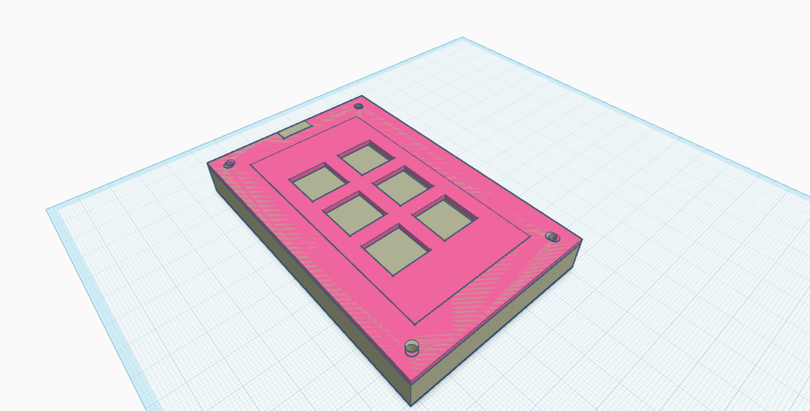
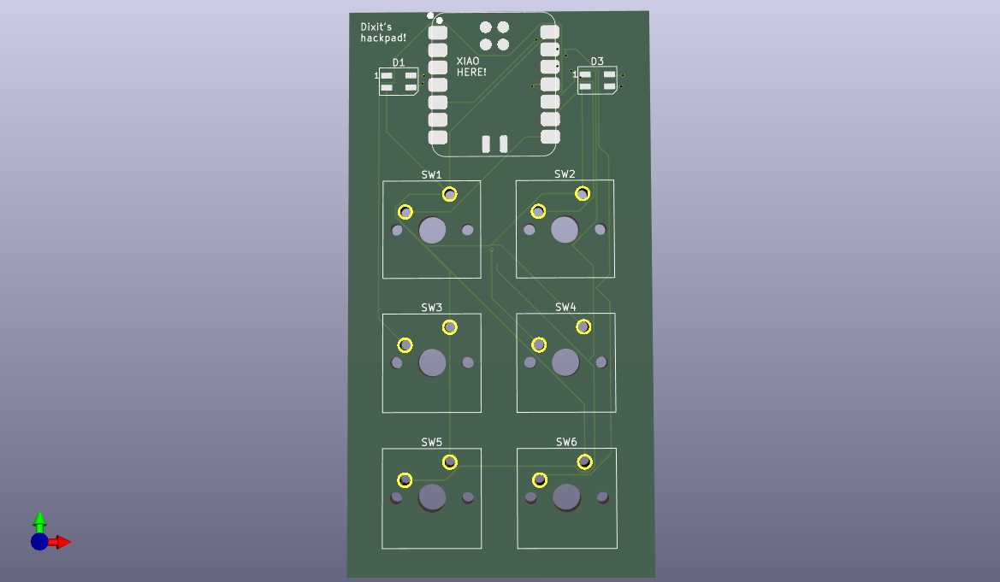

# Dixit's Hackpad

This is a custom 6-key macropad designed for the Hack Club Onboard program.

## Features
- 6 Mechanical Switches (Cherry MX style)
- 2 RGB LEDs (SK6812 MINI-E)
- Powered by Seeed XIAO RP2040
- Custom 3D Printed Case (PLA)

## Bill of Materials (BOM)
| Part            | Quantity | Description                               |
| :-------------- | :------- | :---------------------------------------- |
| Microcontroller | 1        | Seeed Studio XIAO RP2040                  |
| Switches        | 6        | Cherry MX Compatible Mechanical Switches  |
| LEDs            | 2        | SK6812 MINI-E RGB LEDs                    |
| Case            | 1        | Custom 3D Printed PLA Case (Top & Bottom) |
| PCB             | 1        | Custom Designed PCB                       |

## Gallery

### Assembled Case (Overall View)

### PCB Design (3D View)

### Schematic Diagram
