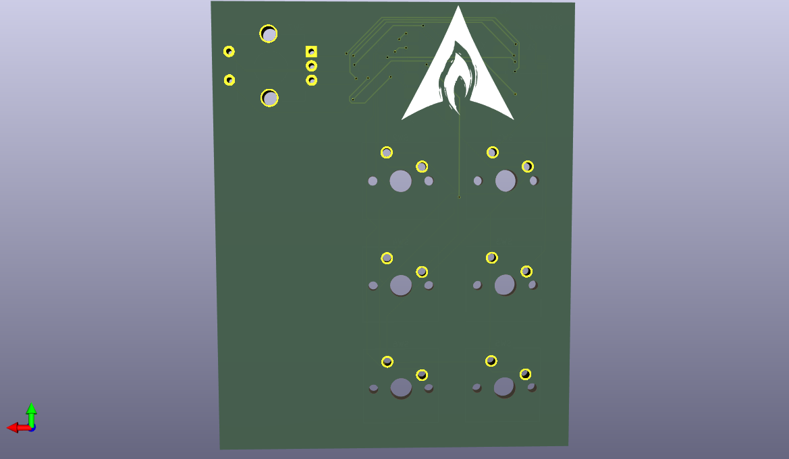
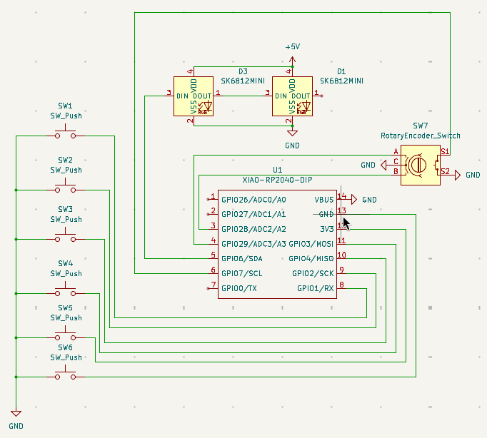
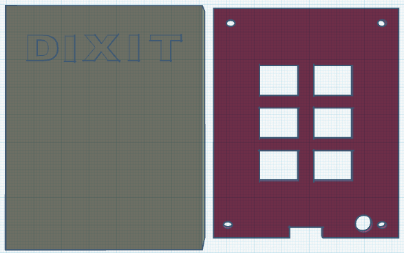

# Dixit's Hackpad

This is a custom 6-key macropad with a rotary encoder designed for the Hack Club Onboard program.

## Features

* 6 Mechanical Switches (Cherry MX style)
* 1 Rotary Encoder (for volume/scrolling)
* 2 RGB LEDs (SK6812 MINI-E)
* Powered by Seeed XIAO RP2040
* Custom 3D Printed Case (PLA) with snap-fit lid
* Custom PCB Art

## Bill of Materials (BOM)

| Part            | Quantity | Description                               |
| :-------------- | :------- | :---------------------------------------- |
| Microcontroller | 1        | Seeed Studio XIAO RP2040                  |
| Switches        | 6        | Cherry MX Compatible Mechanical Switches  |
| Rotary Encoder  | 1        | EC11 Rotary Encoder                       |
| LEDs            | 2        | SK6812 MINI-E RGB LEDs                    |
| Case            | 1        | Custom 3D Printed PLA Case (Top & Bottom) |
| PCB             | 1        | Custom Designed PCB                       |

## Gallery

### PCB Design

### Schematic

### 3D Case Design

